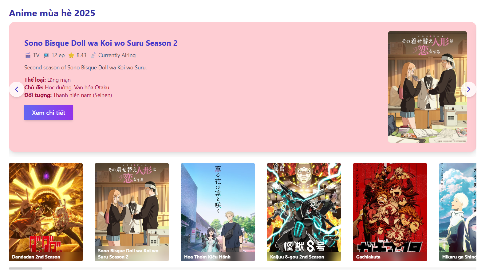
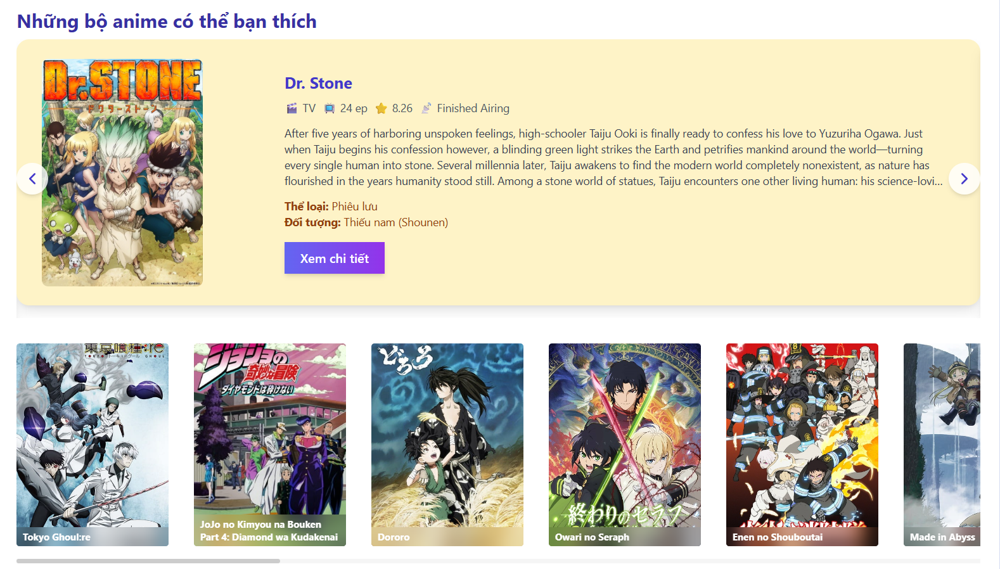
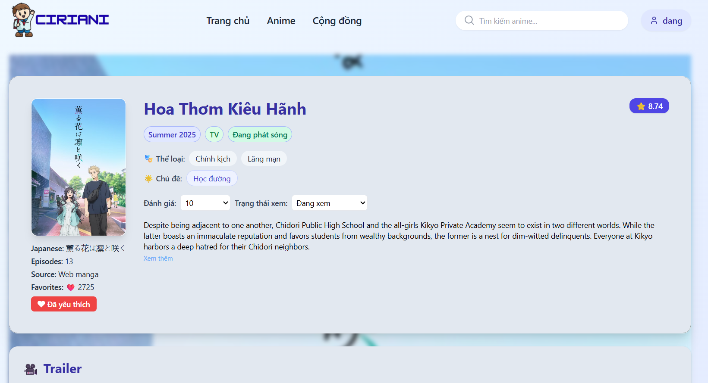
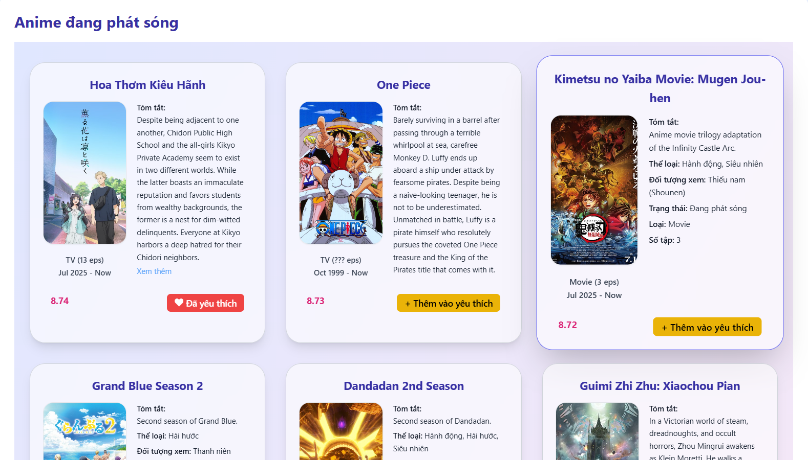

# 🎌 Website thông tin anime tích hợp thảo luận và trợ lý ảo tìm kiếm

Dự án xây dựng một **website thông tin anime** cho phép người dùng tìm kiếm, quản lý danh sách anime, thảo luận và tương tác với **trợ lý ảo AI** để gợi ý nội dung theo sở thích.  
Đây là sản phẩm **luận văn tốt nghiệp** của tôi tại Trường CNTT&TT – Đại học Cần Thơ.

---

## ✨ Chức năng chính

- 🔍 Tìm kiếm anime theo tên, thể loại, chủ đề
- 📝 Quản lý trạng thái anime (đang xem, đã xem, dự định xem, bỏ dở, yêu thích)
- ⭐ Đánh giá và bình luận anime
- 🤖 Trợ lý ảo AI: gợi ý anime theo mùa, theo thể loại, hoặc từ khóa
- 💬 Thảo luận & chat trực tuyến giữa người dùng

---

## 🛠️ Công nghệ sử dụng

- **Frontend**: Next.js, TailwindCSS
- **Backend**: Node.js + Express
- **Database**: MySQL
- **AI Integration**: Python (Xử lý gợi ý & chatbot)
- **Realtime**: Socket.IO

---

## 🎨 Một số giao diện của trang web

### Trang chủ

### Trang chi tiết anime

### Trang tìm kiếm

